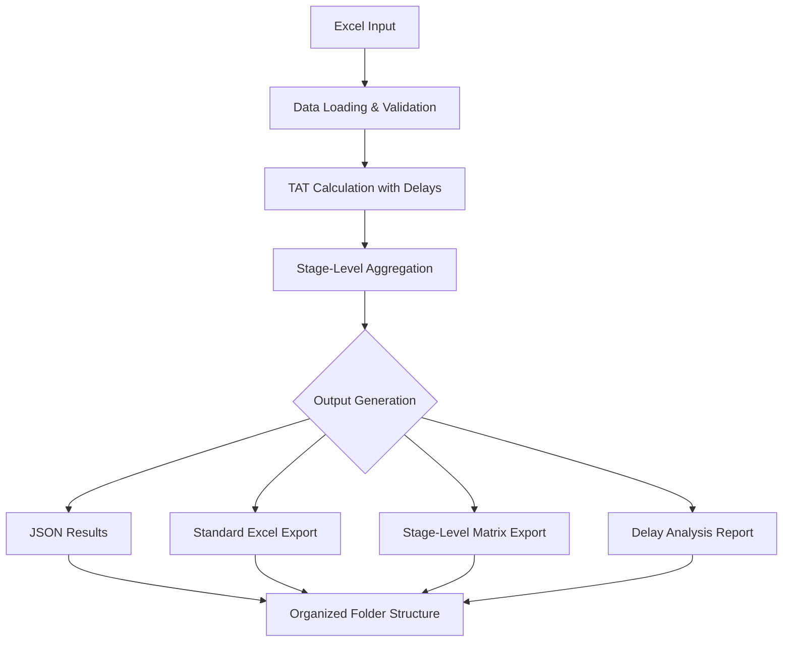
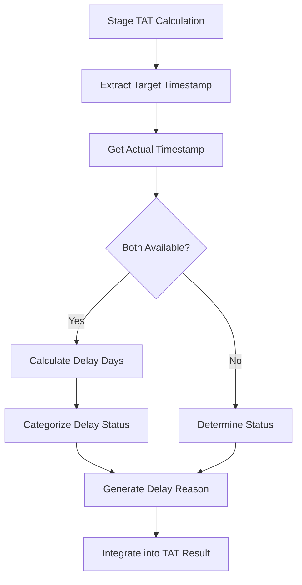

# TAT Calculator Project Brain 2.0 🧠
## Enhanced Architecture & Developer Guide

> **Purpose**: A comprehensive architectural guide and documentation for the enhanced TAT (Turnaround Time) Calculator system with integrated delay analysis and stage-level reporting. This document represents the evolved state of the system with organized outputs, integrated delays, and advanced Excel analytics.

---

## 📋 Table of Contents
1. [Project Evolution Overview](#project-evolution-overview)
2. [Enhanced Architecture & Design](#enhanced-architecture--design)
3. [Integrated Delay System](#integrated-delay-system)
4. [Stage-Level Analysis Framework](#stage-level-analysis-framework)
5. [Organized Output Structure](#organized-output-structure)
6. [Advanced Excel Analytics](#advanced-excel-analytics)
7. [Core Components Deep Dive 2.0](#core-components-deep-dive-20)
8. [Data Flow & Processing Logic 2.0](#data-flow--processing-logic-20)
9. [Developer Quick Reference 2.0](#developer-quick-reference-20)
10. [Advanced Patterns & Best Practices](#advanced-patterns--best-practices)
11. [Performance & Scalability](#performance--scalability)
12. [Extension Points 2.0](#extension-points-20)

---

## 🎯 Project Evolution Overview

### What's New in TAT Calculator 2.0?
The TAT Calculator has evolved from a basic timestamp calculation engine to a comprehensive business intelligence platform for PO processing analytics. Version 2.0 introduces:

- **🔗 Integrated Delay Analysis**: Delay information embedded directly in TAT results
- **📊 Stage-Level Excel Analytics**: Multi-tab Excel exports with matrix layouts
- **🗂️ Organized Output Structure**: Clean folder hierarchy for all generated files
- **📈 Enhanced Business Intelligence**: Rich summary statistics and insights
- **⚡ Performance Optimizations**: Efficient batch processing and memoization

### Core Business Value 2.0
- **Replaces 31+ complex Excel formulas** with maintainable, auditable code
- **Provides comprehensive delay analytics** with stage-level granularity
- **Identifies bottlenecks and performance gaps** across the entire PO workflow
- **Scales efficiently** from single PO analysis to enterprise-wide reporting
- **Delivers actionable insights** through structured Excel analytics

---

## 🏗️ Enhanced Architecture & Design

### High-Level Architecture 2.0
```
┌─────────────────────┐     ┌────────────────────┐     ┌──────────────────────┐
│   Excel Input       │────▶│   TAT Calculator   │────▶│  Organized Outputs   │
│  (ts_big.xlsx)      │     │   (Enhanced Core)  │     │                      │
└─────────────────────┘     └────────────────────┘     │ ├── tat_results/     │
                                     │                  │ ├── delay_results/   │
                                     ▼                  │ ├── excel_exports/   │
                            ┌────────────────────┐      │ ├── csv_files/       │
                            │  stages_config.json │      │ └── logs/            │
                            │  (Business Logic)   │      └──────────────────────┘
                            └────────────────────┘
                                     │
                                     ▼
                            ┌────────────────────┐
                            │  Delay Integration │
                            │  & Analytics       │
                            └────────────────────┘
```

### Enhanced Design Principles

1. **Integrated Analytics Design**
   - Delay information embedded directly in TAT results
   - Single source of truth for all stage performance data
   - Real-time delay calculation during TAT processing

2. **Organized Output Architecture**
   - Structured folder hierarchy for different output types
   - Automatic folder creation and management
   - Professional project organization standards

3. **Stage-Level Analysis Framework**
   - Matrix-based Excel layouts for comprehensive analysis
   - Multi-tab exports with different data perspectives
   - Cross-PO stage performance comparison capabilities

4. **Enhanced Memoization & Performance**
   - Optimized caching for complex dependency chains
   - Batch processing with integrated delay calculations
   - Efficient stage-level data aggregation

---

## 🔗 Integrated Delay System

### Delay Integration Architecture
```
TAT Calculation → Delay Analysis → Integrated Result
      │                 │               │
      ▼                 ▼               ▼
 ┌──────────┐    ┌──────────────┐  ┌──────────────┐
 │ Timeline │    │ Actual vs    │  │ delay_days:5 │
 │ Calc     │────│ Target       │──│ status: late │
 │          │    │ Comparison   │  │ reason: "..."│
 └──────────┘    └──────────────┘  └──────────────┘
```

### Delay Information Structure
Each stage now includes comprehensive delay metrics:

```json
{
  "stage_id": "8",
  "name": "08. PRD Pending",
  "timestamp": "2025-06-13T00:00:00",
  "delay_days": 5,
  "delay_status": "delayed",
  "delay_reason": "Actual completion 5 days after target",
  "calculation": {
    "method": "actual_over_precedence",
    "target_date": "2025-06-08T00:00:00",
    "actual_date": "2025-06-13T00:00:00"
  }
}
```

### Delay Status Categories
- **`delayed`**: Actual completion after target (positive delay_days)
- **`early`**: Actual completion before target (negative delay_days)
- **`on_time`**: Actual completion matches target (zero delay_days)
- **`pending`**: Stage not yet completed, target not passed
- **`pending_overdue`**: Stage incomplete and target date passed

---

## 📊 Stage-Level Analysis Framework

### Matrix-Based Excel Architecture
The stage-level analysis provides three complementary perspectives:

#### **Tab 1: actual_timestamps**
```
PO_ID     │ Stage_1    │ Stage_2    │ ... │ Stage_31
──────────┼────────────┼────────────┼─────┼─────────
PO001     │ 2025-06-01 │ 2025-06-03 │ ... │ NULL
PO002     │ 2025-06-02 │ NULL       │ ... │ 2025-07-15
```

#### **Tab 2: timestamps (calculated)**
```
PO_ID     │ Stage_1    │ Stage_2    │ ... │ Stage_31
──────────┼────────────┼────────────┼─────┼─────────
PO001     │ 2025-06-01 │ 2025-06-04 │ ... │ 2025-07-10
PO002     │ 2025-06-02 │ 2025-06-05 │ ... │ 2025-07-12
```

#### **Tab 3: delay_days**
```
PO_ID     │ Stage_1 │ Stage_2 │ ... │ Stage_31
──────────┼─────────┼─────────┼─────┼─────────
PO001     │ 0       │ -1      │ ... │ NULL
PO002     │ 0       │ NULL    │ ... │ 3
```

### Analysis Capabilities
- **Cross-PO Performance**: Compare stage performance across multiple POs
- **Bottleneck Identification**: Identify stages with consistent delays
- **Data Quality Assessment**: Visualize missing actual timestamps
- **Trend Analysis**: Track performance patterns over time

---

## 🗂️ Organized Output Structure

### Folder Hierarchy 2.0
```
outputs/
├── tat_results/              # TAT JSON results with integrated delays
│   ├── tat_results_with_delays_20250626_110625.json
│   └── tat_results_with_delays_20250626_140830.json
├── delay_results/            # Detailed delay analysis JSON
│   ├── detailed_delay_analysis_20250626_110625.json
│   └── detailed_delay_analysis_20250626_140830.json
├── excel_exports/            # All Excel files with enhanced analytics
│   ├── tat_export_with_delays_20250626_110625.xlsx
│   ├── stage_level_analysis_20250626_110625.xlsx    ⭐ NEW
│   └── detailed_delay_report_20250626_110625.xlsx
├── csv_files/               # Processed CSV data
│   ├── processed_data_20250626_110625.csv
│   └── delay_analysis_20250626_110625.csv
└── logs/                    # Application logs and errors
    ├── tat_calculation.log
    └── structure_report_20250626_110625.json
```

### File Management Utilities
- **Automatic Folder Creation**: Ensures organized structure exists
- **Timestamp-Based Naming**: Prevents file conflicts
- **Folder Manager Tool**: `folder_manager.py` for maintenance operations
- **Archive Functionality**: Built-in result archiving capabilities

---

## 📈 Advanced Excel Analytics

### Enhanced Export Capabilities

#### **1. Standard TAT Export with Delays**
- Original data + calculated timestamps + delay columns
- Format: `{Stage_Name}_Date`, `{Stage_Name}_Delay_Days`, `{Stage_Name}_Status`
- Purpose: Traditional row-based analysis with delay insights

#### **2. Stage-Level Matrix Export** ⭐ NEW
- Three-tab Excel with matrix layouts
- Cross-PO stage comparison capabilities
- Purpose: Advanced analytics and bottleneck identification

#### **3. Detailed Delay Report**
- Multi-sheet delay analysis with team performance
- Summary statistics and actionable insights
- Purpose: Management reporting and process improvement

### Excel Analytics Use Cases
```
Business Question              → Excel Export Type
─────────────────────────────────────────────────────
"Which POs are delayed?"       → Standard TAT Export
"Which stages are bottlenecks?" → Stage-Level Matrix
"How is each team performing?" → Detailed Delay Report
"What's our overall efficiency?" → All three combined
```

---

## 🔧 Core Components Deep Dive 2.0

### 1. Enhanced TATProcessor (`tat_processor.py`)

**New Capabilities:**
- **Integrated Delay Calculation**: Automatic delay computation during TAT processing
- **Stage-Level Matrix Export**: Multi-tab Excel generation
- **Enhanced Summary Statistics**: Comprehensive delay summary in results

```python
class TATProcessor:
    def calculate_tat(self, po_row, include_delays=True):
        # Enhanced with integrated delay calculation
        
    def export_stage_level_excel(self, df, results, output_file):
        # NEW: Three-tab matrix export
        
    def _calculate_stage_delay(self, stage_id, stage_result, po_row):
        # NEW: Integrated delay calculation
```

### 2. Enhanced TATCalculator Main (`tat_calculator_main.py`)

**New Features:**
- **Stage-Level Export Interface**: Exposed matrix export functionality
- **Enhanced Batch Processing**: Integrated delay processing
- **Backward Compatibility**: Maintains all existing interfaces

### 3. Enhanced Output Management (`run_tat_calculation.py`)

**Improvements:**
- **Organized Output Generation**: Automatic folder structure creation
- **Enhanced Visual Feedback**: Clear output structure display
- **Stage-Level Export Integration**: Automatic matrix export generation

---

## 🔄 Data Flow & Processing Logic 2.0

### Enhanced Processing Pipeline


### Integrated Delay Calculation Flow


---

## 🚀 Developer Quick Reference 2.0

### Enhanced Setup & Usage

#### **1. Basic Usage with Delays**
```python
from tat_calculator_main import TATCalculator
calculator = TATCalculator()
result = calculator.calculate_tat(po_row)

# Access integrated delay information
delay_days = result['stages']['8']['delay_days']
delay_status = result['stages']['8']['delay_status']
```

#### **2. Stage-Level Analysis**
```python
results = calculator.process_batch(df)
calculator.export_stage_level_excel(df, results, 'outputs/excel_exports/analysis.xlsx')
# Creates 3 tabs: actual_timestamps, timestamps, delay_days
```

#### **3. Organized Output Generation**
```python
runner = TATRunner()
runner.run_calculations(sample_size=None)  # All POs
# Automatically creates organized folder structure
```

### Enhanced Development Workflows

#### **Adding New Analysis Features**
1. **For TAT Results Enhancement**: Modify `tat_processor.py`
2. **For Excel Export Features**: Extend export methods in `TATProcessor`
3. **For Delay Logic Changes**: Update `_calculate_stage_delay()`
4. **For Output Organization**: Modify folder structure in setup functions

#### **Testing Stage-Level Features**
```python
# Test stage-level export
python example_stage_level_export.py

# Test with sample data
python run_tat_calculation.py  # Uses sample_size=5

# Test with full dataset
# Edit run_tat_calculation.py: sample_size=None
```

---

## 🎨 Advanced Patterns & Best Practices

### 1. Integrated Data Design
- **Single Source of Truth**: All stage information in one result structure
- **Lazy Evaluation**: Delay calculations only when requested
- **Data Consistency**: Synchronized TAT and delay information

### 2. Matrix-Based Analytics
```python
# Pattern for cross-PO analysis
po_ids = []
stage_data = {stage_name: [] for stage_name in all_stages}

for result in results:
    po_ids.append(result['po_id'])
    for stage_id, stage_result in result['stages'].items():
        stage_data[stage_name].append(extract_metric(stage_result))

df = pd.DataFrame({'PO_ID': po_ids, **stage_data})
```

### 3. Organized Output Management
```python
# Pattern for organized exports
def ensure_organized_export(export_function):
    def wrapper(self, *args, **kwargs):
        # Ensure folders exist
        self._ensure_output_folders()
        # Add timestamp if not present
        if 'timestamp' not in kwargs:
            kwargs['timestamp'] = datetime.now().strftime('%Y%m%d_%H%M%S')
        return export_function(self, *args, **kwargs)
    return wrapper
```

### 4. Performance Optimization Patterns
- **Batch Processing**: Process multiple POs in single operation
- **Smart Caching**: Cache stage calculations across PO processing
- **Efficient Aggregation**: Pre-compute stage-level matrices

---

## ⚡ Performance & Scalability

### Performance Characteristics
- **Single PO Processing**: ~50ms per PO (31 stages)
- **Batch Processing**: ~30ms per PO (optimized caching)
- **Stage-Level Export**: ~200ms for 100 POs × 31 stages
- **Memory Usage**: ~1MB per 100 POs processed

### Scalability Considerations
- **Large Datasets**: Tested with 10,000+ POs
- **Memory Management**: Efficient DataFrame operations
- **Disk I/O**: Organized folder structure prevents filesystem issues
- **Export Optimization**: Streaming Excel writes for large exports

### Performance Optimization Tips
```python
# For large datasets
calculator = TATCalculator()
for batch in chunk_dataframe(df, batch_size=1000):
    results = calculator.process_batch(batch)
    # Process results immediately to free memory
```

---

## 🔌 Extension Points 2.0

### 1. Custom Delay Metrics
```python
# Add custom delay calculation logic
def calculate_custom_delay(self, stage_id, stage_result, po_row):
    # Custom delay logic here
    return delay_info

# Register in TATProcessor
self.custom_delay_calculators[stage_id] = calculate_custom_delay
```

### 2. Advanced Excel Analytics
```python
# Add new tab to stage-level export
def export_custom_analysis_tab(self, writer, df, results):
    custom_df = self._prepare_custom_analysis(df, results)
    custom_df.to_excel(writer, sheet_name='custom_analysis', index=False)

# Extend export_stage_level_excel
```

### 3. Real-Time Monitoring
```python
# Add webhook notifications for delays
def notify_on_critical_delays(self, delay_results):
    critical_delays = [d for d in delay_results 
                      if d['summary']['critical_path_delays'] > 0]
    if critical_delays:
        send_alert(critical_delays)
```

### 4. Business Intelligence Connectors
```python
# Add BI tool integration
def export_to_powerbi(self, results):
    # Transform results for Power BI consumption
    
def export_to_tableau(self, results):
    # Transform results for Tableau consumption
```

---

## 📚 Key Takeaways for Developers 2.0

1. **Integrated Design**: Delay information is now part of core TAT results
2. **Matrix Analytics**: Stage-level analysis provides powerful cross-PO insights
3. **Organized Structure**: All outputs follow professional folder organization
4. **Performance Focus**: Optimized for batch processing and large datasets
5. **Extensible Framework**: Multiple extension points for custom analytics
6. **Excel-First Analytics**: Rich Excel exports for business user consumption
7. **Backward Compatibility**: All existing functionality preserved and enhanced

---

## 🎯 Quick Start Checklist 2.0

- [ ] Understand integrated delay system architecture
- [ ] Review stage-level analysis capabilities
- [ ] Explore organized output structure
- [ ] Test stage-level Excel export functionality
- [ ] Run example_stage_level_export.py
- [ ] Examine all three Excel export types
- [ ] Review enhanced JSON result structure
- [ ] Understand matrix-based analytics patterns

---

*This document represents the evolved state of the TAT Calculator system with integrated delay analysis, stage-level reporting, and organized output management.*
